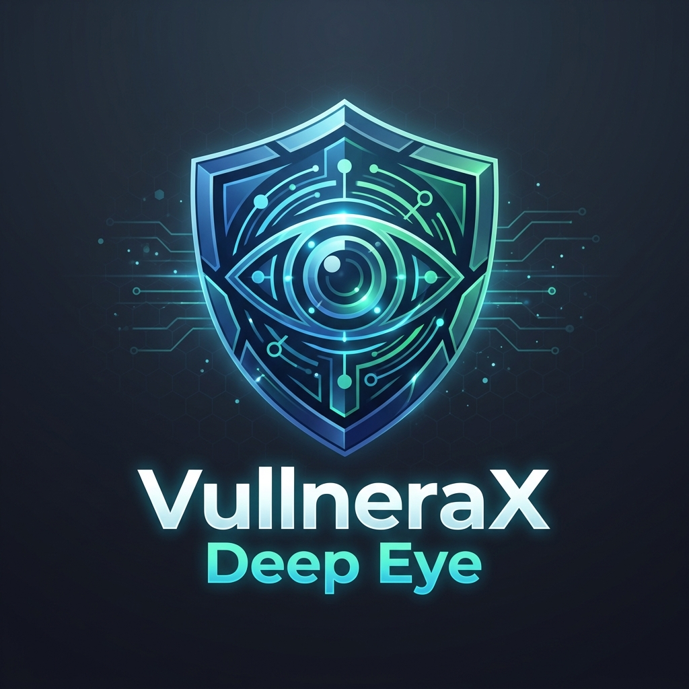

#  VulneraX Deep Eye

[](https://opensource.org/licenses/MIT)
[](https://www.python.org/downloads/)
[](https://react.dev/)
[](https://fastapi.tiangolo.com/)

**VulneraX Deep Eye** is an advanced, AI-powered penetration testing and vulnerability scanning suite. Designed for modern security engineers, it combines a high-performance Python scanning engine with a cutting-edge React dashboard to provide real-time insights into your application's security posture.

---

## ✨ Key Features

- 🧠 **AI-Powered Payloads**: Leverages LLMs to generate context-aware security payloads for deeper vulnerability detection.
- ⚡ **Real-time Dashboard**: Monitor active scans, findings, and engine status via high-speed WebSockets.
- 🔍 **Comprehensive Scanning**: Includes reconnaissance, SQLi detection, XSS scanning, CORS analysis, and more.
- 📊 **Rich Analytics**: Visualized severity distribution, module frequency, and historical security trends.
- 📄 **Professional Reporting**: Generate detailed PDF or JSON security reports with one click.
- 🚀 **Modern Tech Stack**: Built with Vite, TanStack Start, Tailwind CSS, and FastAPI.

---

## 🚀 Getting Started

### Prerequisites

- **Node.js**: 20.x or higher
- **Python**: 3.10 or higher
- **OpenAI API Key** (Optional, for AI-powered scanning)

### Installation

1. **Clone the repository**
   ```bash
   git clone https://github.com/your-username/vulnerax-deep-eye.git
   cd vulnerax-deep-eye
   ```

2. **Setup the Backend**
   ```bash
   cd backend
   python -m venv venv
   source venv/bin/activate  # On Windows: venv\Scripts\activate
   pip install -r requirements.txt
   ```

3. **Setup the Frontend**
   ```bash
   cd ..
   npm install
   ```

### Running the Application

1. **Start the Backend Server**
   ```bash
   cd backend
   python main.py
   ```
   The API will be available at `http://localhost:8000`.

2. **Start the Frontend Development Server**
   ```bash
   cd ..
   npm run dev
   ```
   The dashboard will be available at `http://localhost:3000` (or the port shown in your terminal).

---

## 🛠️ Configuration

Configure the scanning engine by editing `backend/config/config.yaml`. You can set:
- Target URLs
- AI Providers (OpenAI, Anthropic, etc.)
- Scan depth and thread counts
- Module-specific settings

---

## 🛡️ Security Disclaimer

This tool is for **educational and authorized security testing purposes only**. Scanning targets without explicit permission is illegal and unethical. Use responsibly.

---

## 📄 License

This project is licensed under the MIT License - see the [LICENSE](LICENSE) file for details.

---

Built with ❤️ by the VulneraX Team.
